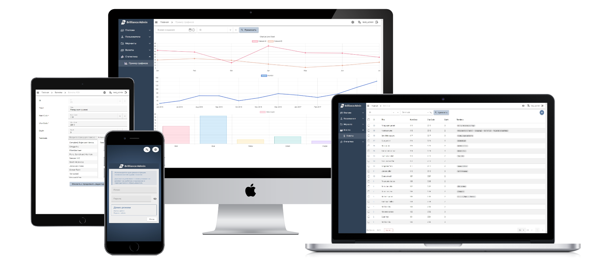

<style>
  .md-typeset h1,
  .md-content__button {
    display: none;
  }
  
  .md-content__inner.md-typeset {
    padding: 20px 20px !important;
  }
  .links {
    font-size: 24px;
    font-weight: 700;
  }
</style>

<div align="center">
  

  <p>
    <a href="https://pypi.org/project/brilliance-admin/">
      
    </a>
    <a href="https://github.com/brilliance-admin/backend-python/actions">
      
    </a>
  </p>

  <p>
    Simple and lightweight data managment framework powered by <code>FastAPI</code> and <code>Vue3 Vuetify</code> all-in-one.<br>
    Integrated with <code>SQLAlchemy</code>. Inspired by Django Admin and DRF.<br>
    <em>Some call it heavenly in its brilliance.</em>
  </p>

<div class="links">
  <a href="https://brilliance-admin.com/">Live Demo</a> |
  <a href="https://github.com/brilliance-admin/backend-python/tree/main/example">Demo Sources</a> |
  <a href="https://github.com/brilliance-admin/backend-python">Github Repo</a>
</div>

  

</div>

Documentation work in progress


### Brilliance Admin provides

A quick way to create a data management interface using:

- Admin page - endpoint with a prebuilt SPA [frontend Vue3 + Vuetify](https://github.com/brilliance-admin/frontend) <br>
This endpoint can be added to any ASGI compatable backend. For existing project or standalone admin app.
- API to fetch the UI JSON schema
- API methods for that UI to work with (to read and modify data)

## Key ideas

- **API Oriented** <br>
Data generation/updating API separated from rendering fontend with zero hardcode, this makes it possible to have a single frontend with multiple backend implementations in different languages and makes test coverage easier.
- **Rich visualization**  <br>
Providing rich and convenient ways to display and manage data (tables, charts, etc) from any data source.
- **UI JSON Schema** <br>
Represents the data describing the structure of entire admin panel UI. <br>
You only need to specify what should be rendered. The frontend will display it and automatically request data from the backend for rendering or updates.
- **ORM** <br>
Automatic generation from ORM for schema UI frontend and backend methods for CRUD operations.
- **Minimal boilerplate** <br>
Focused on simplified, but rich configuration.

## Features

* Tables with full CRUD support, including filtering, sorting, and pagination.
* Ability to define custom table actions with forms, response messages, and file downloads.
* Graphs via ChartJS
* Localization support
* Adapted for different screen sizes and mobile devices
* Auth via any account data source

**Integrations:**

* **SQLAlchemy** - schema autogeneration for tables + CRUD operations + authorization

**Planned:**

* Dashboard features
* Role-based access permissions system via interface
* Backend interface for storing and viewing action history in the admin interface
* Nested data support for creation and detail views (inline editing), nested CRUD workflows
* Django ORM integration
* Support for Oauth providers

## Installation

``` shell
pip install brilliance-admin
```
<div class="links">
  <a href="how-to-start/">How to start</a>
</div>

## Comparison of Similar Projects

The project closest in concept is [React Admin](https://github.com/marmelab/react-admin). <br>
It is an SPA frontend that store the schema UI inside and works with separate API backend providers.

The key difference of Brilliance Admin is that its all-in-one. <br>
It is more focused on rapid setup for data management, without the need to work with frontend configuration, while it still available.

## Comparison of Similar Python Projects

| Criterion | Brilliance Admin | Django Admin | FastAPI Admin | Starlette Admin | SQLAdmin |
|---------|------------------|--------------|---------------|-----------------|----------|
| Base framework | FastAPI | Django | FastAPI | Starlette | FastAPI |
| ASGI compatible | Yes | Partial | Yes | Yes | Yes |
| Rendering model | Prebuilt Vue 3 + Vuetify SPA + Jinja2 | Server-side Django templates | Server-side Jinja2 templates + Tabler UI | Server-side Jinja2 templates + Tabler UI | Server-side Jinja2 templates + Bootstrap |
| Frontend architecture | Separate frontend (SPA) | Classic server-rendered UI | Server-rendered UI with JS interactivity | Server-rendered UI with JS interactivity | Server-rendered UI |
| Data source | Any source + SQLAlchemy | Django ORM | Tortoise ORM | Any source + SQLAlchemy, MongoDB | SQLAlchemy |
| Multiple databases per model | Yes | Database routers | No (global engine) | Yes (session per ModelView) | No (single engine per Admin) |
| Schema generation | User-defined format | From Django models | From ORM models | User-defined format | From SQLAlchemy models |
| Async support | Yes | No | Yes | Yes | Yes |
| API-first approach | Yes | No | Partially | Partially | No |
| Built-in Localization | Yes | Yes | No | No | No |
